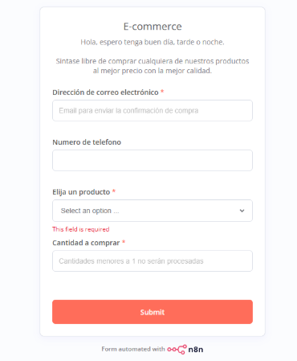
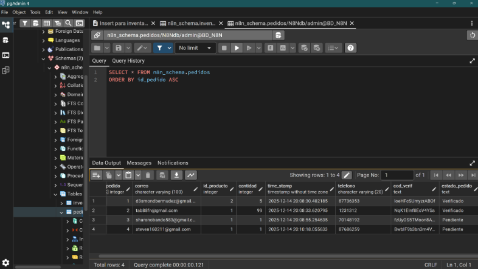
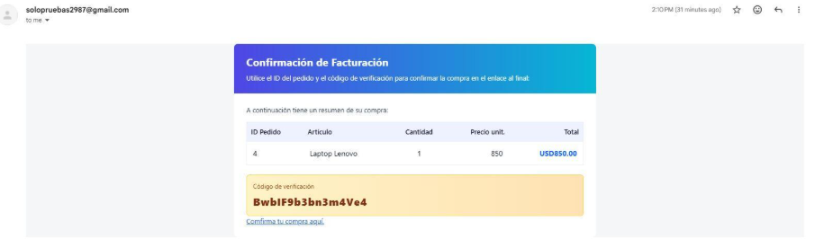

#  Automatizacion de pedidos con n8n

Trabajo universitario grupal de un flujo automatizado para el procesamiento de pedidos mediante formulario web, con formateo en Python, almacenamiento en base de datos y notificación por correo electrónico.

---

##  Descripción

Este proyecto automatiza el ciclo de vida de un pedido desde su recepción hasta la notificación al usuario, integrando las siguientes etapas:

1. **Formulario web** — Captura los datos del pedido.
2. **Script Python** — Formatea y valida la información recibida.
3. **Base de datos** — Registra el pedido de forma persistente.
4. **Gmail** — Notifica al usuario con los detalles del pedido.

---

### Formulario de Pedidos

Interfaz de entrada de datos del cliente.

### Base de Datos

Los pedidos formateados se insertan mediante el nodo de PostgreSQL.

---

### Notificación por Gmail

El nodo **Gmail** envía una confirmación automática al cliente con el resumen del pedido.

---

### Demostración
Enlace de un video con la demostración del proyecto funcional

[Ver video](https://drive.google.com/file/d/1q6wfYHu2lR-cTxgqqqNq1arLiZROjhkY/view?usp=sharing)
